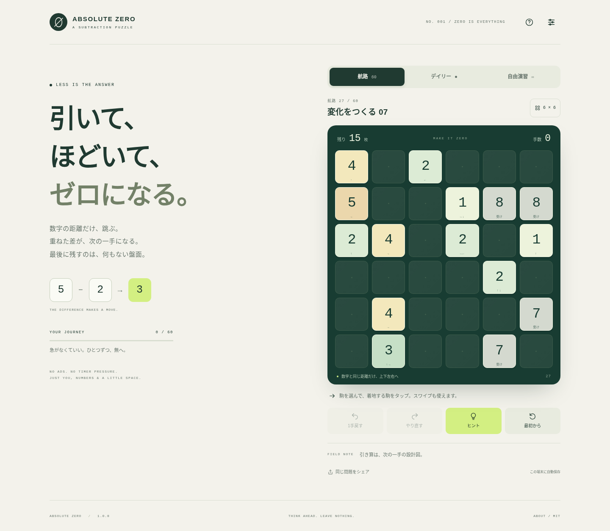

# Absolute Zero

### 引いて、ほどいて、ゼロになる。

数字の距離だけ、跳ぶ。重ねた差が、次の一手になる。
最後に残すのは、何もない盤面。

**5×5〜7×7 / 数字1〜9 / 60の航路 / 毎日の問題 / 自由演習 / ローカル保存 / MIT**



上の画像は旧版v1.0.0の画面です。v1.0.2では下記の明るい配色へ変更しています。

**[▶ ブラウザで遊ぶ](https://hiroshitanaka-creator.github.io/absolute-ZeRo/)** · [ルール](#ルール) · [開発とテスト](#開発とテスト) · [MIT License](LICENSE)

[](https://github.com/hiroshitanaka-creator/absolute-ZeRo/actions/workflows/pages.yml)

バージョン **1.0.2**。インストール・アカウント・APIキー不要。ブラウザで、次の一手を考えるパズルです。

> 初回公開には、管理者による Settings → Pages → Source → GitHub Actions の選択が必要です。未設定の間はプレイ用リンクが404になります。

## v1.0.2 の配色更新

背景をクールホワイト、盤面を淡いブルーへ変更し、数字の駒をミント・スカイブルー・イエローなどのパステルカラーに揃えました。選択中は青い枠、着地先は緑の枠と結果表示で区別します。ダークモードも青系に統一しています。

[今回の変更と検証範囲](docs/PALETTE_UPDATE_v1.0.1.md)。

PWAの旧版を開いている場合は、設定に「新しい版を適用して再読み込み」が表示されたら押してください。途中盤面とクリア記録の保存形式は変更していません。

## すぐに遊ぶ

### パソコン

**[プレイ用ページ](https://hiroshitanaka-creator.github.io/absolute-ZeRo/)** をブラウザで開きます。ファイル版を使う場合は、次の方法でも遊べます。

`Absolute-Zero-standalone.html` をChrome、Edge、Safariなどのブラウザで開きます。
HTML・CSS・JavaScript・アイコンを1ファイルにまとめています。インストール、ビルド、アカウント、APIキーは不要です。

ソース版の `index.html` を使う場合は、隣の `core.js`、`app.js`、`styles.css` などを移動せず、フォルダ構成を維持してください。

### iPhone

1. Safariで **[Absolute Zeroを開く](https://hiroshitanaka-creator.github.io/absolute-ZeRo/)**。
2. 駒をタップし、枠が付いた着地先をタップしてプレイ。
3. アプリのように起動したい場合は、Safariの共有メニューから **「ホーム画面に追加」**。

最初のオンライン読み込みでキャッシュが完了した後は、オフライン起動に対応する構成です。実機iPhoneでのPWAインストールとオフライン起動の最終確認は未実施です。

ZIPやHTMLを「ファイル」アプリでプレビューする代わりに、上のプレイ用ページをSafariで開いてください。

## ルール

| 操作 | ルール |
|---|---|
| 選択 | 動かす駒をタップする |
| 移動 | 上下左右に、駒の数字と**ちょうど同じマス数**だけ跳ぶ |
| 飛び越し | 途中の駒は無視する |
| 着地 | 別の駒があるマスにだけ着地できる |
| 合成 | 着地点に `abs(動かした数字 - 着地先の数字)` が残る |
| 消滅 | 差が0なら、両方の駒が消える |
| 勝利 | 盤面の駒が0枚になる |
| 行き止まり | 駒が残っているのに合法手がなくなる。戻して再挑戦できる |

行き先をタップする代わりに、動かす駒から上下左右へスワイプしても操作できます。スワイプした長さではなく、数字で移動距離が決まります。

**5×5の「5〜9」、6×6の「6〜9」、7×7の「7〜9」は自分から動けません。**
盤外に飛んでしまうためです。ただし、他の駒の着地点になります。画面では「受け」と表示します。数字を勝手に1〜4などへ制限してはいません。

プレイ中に新しい駒は出現しません。一度空いたマスが再び埋まることもありません。

## 3つのモード

**航路：全60面。** 最初の4面はルールを順番に体験する固定問題。5面目からは固定シードによる生成問題です。6章構成で、後半は7×7・最大30枚になります。全問を最初から選べます。枚数や盤面サイズは段階的に増やしていますが、人間による難易度の厳密な順序付けはまだ行っていません。

**デイリー：毎日3盤面。** 日本時間0時、5×5・6×6・7×7の問題が更新されます。同じ日付・難易度・コード版なら同じ問題です。プレイ中の盤面は更新時刻を過ぎても勝手に切り替わりません。

**自由演習：何度でも生成。** サイズを選んで新しい問題へ。共有された `AZ1-` 形式の問題コードもここから入力できます。盤面の重複が絶対に起きないことや、文字通り無限の異なる問題が存在することは保証していません。

## 思考を止めない機能

- 1手戻す・戻した手の再実行・初期配置からの再挑戦。
- 全消しの経路を検証した手だけを示すヒント。別経路に進んだ後はローカルWorkerで探索します。
- 着地できる駒と、着地後に残る数字の表示。PCのキーボード操作にも対応。
- 明暗テーマ、効果音、アニメーション切り替え、端末のモーション軽減設定への対応。
- 途中盤面の自動保存、クリア記録、デイリー連続日数、JSONによる記録の書き出し・読み込み。
- 問題コードと結果の共有。共有文には攻略手順を含めません。

星は「全消し」「ヒントなし」「戻す・最初からの操作なし」の3条件です。最短手数の認定ではありません。

### ヒントの扱い

初期盤面には検証済みの解答手順があります。プレイヤーが別経路へ進んだ場合、最大220,000探索ノード・約4.5秒の上限で解答を探索します。上限到達は**不明**であり、「詰み」とは表示しません。

探索で解答が見つかった場合は、その手順を実際に全消しまで再検証します。全探索が完了して経路がなかった場合だけ、全消し不能と表示します。確認できない場合も、解答が確認済みの過去の局面へ戻れます。

## 保存とプライバシー

保存キーは `absolute-zero:v1`。ブラウザ内にのみ保存し、クラウド同期や外部送信を行いません。途中盤面は直近20件、クリア記録は別に保持します。保存には履歴を使い、読み込み時に各移動をルールに照らして再検証します。

ブラウザデータ削除、保存容量不足、プライベートモード、ローカルHTMLに対するブラウザ仕様などで保存できない場合があります。長く残す記録は、設定の「記録を書き出す」で保管してください。単体HTMLと公開版、別のブラウザ同士の保存は自動移行しません。

広告、アクセス解析、外部フォント、外部画像、外部ライブラリ、APIキーは使用しません。音はWeb Audioによるローカル合成です。公開ホストへのゲームファイル取得と、明示操作による共有は別です。

## GitHub Pagesに公開

### 同梱Actionsを使う

このリポジトリでは公開ワークフローを同梱済みです。初回のみ、[Pages設定](https://github.com/hiroshitanaka-creator/absolute-ZeRo/settings/pages)で **GitHub Actions** を選び、[公開ワークフロー](https://github.com/hiroshitanaka-creator/absolute-ZeRo/actions/workflows/pages.yml)の **Run workflow** を実行してください。以後は `main` の更新時にテスト・ビルド・公開が動きます。

別のリポジトリへ導入する場合：

1. 新しいリポジトリのルートに、このフォルダの**中身**を配置します。`index.html` がルートに来るようにします。隠しフォルダの `.github` も含めます。
2. デフォルトブランチを `main` にします。別名なら `.github/workflows/pages.yml` の対象ブランチを書き換えます。
3. リポジトリの **Settings → Pages → Source** で **GitHub Actions** を選びます。
4. `main` にpushするか、Actionsから **Test and publish Absolute Zero** を実行します。
5. テスト成功後に `dist/` のみを公開します。Actionsが出力したURLをSafariで開いてください。

テストに失敗した場合、公開ジョブには進みません。Pull Requestのワークフローには公開権限を与えていません。

### ブランチ公開を使う

ビルドなしで、ソースのルートを `main / (root)` として公開することもできます。この場合は自動公開用の `pages.yml` を削除するか無効化し、2つの公開方式を同時に使わないでください。どちらの場合も、プロジェクト用サブパスに対応する相対URLで構成しています。

## 開発とテスト

Node.js 22以上。ランタイムのnpm依存はなく、`npm install` は不要です。

```sh
npm test
npm run build
npm run serve
```

開発サーバーは `http://127.0.0.1:8080` です。ポートを変える場合、PowerShellでは次のようにします。

```powershell
$env:PORT=8765
npm run serve
```

ブラウザ操作テストは任意です。PythonとPlaywrightがある開発環境で実行します。

```sh
python tests/browser_smoke.py
```

このテストは外部URLへ移動せず、単体HTMLをChromiumへ直接読み込ませます。保存領域はテスト用代替実装です。実機SafariやネイティブのPWAインストール試験の代わりではありません。

## ファイル構成

```text
index.html                   画面とアクセシビリティ構造
styles.css                   レスポンシブUI・明暗テーマ・演出
core.js                      純粋ルール・逆生成・解答検証・探索
app.js                       入力・表示・ローカル保存・Worker連携
manifest.webmanifest / sw.js PWA設定・スコープ限定キャッシュ
icons/                       独自SVG・PNGアイコン
Absolute-Zero-standalone.html PC向け自己完結版
LICENSE                      MITライセンス全文
tests/                       ルール・生成・保存・UI検証
tools/                       配布ビルド・ローカルサーバー
docs/                        設計・テスト結果・画面キャプチャ
.github/workflows/           テスト・Pages公開
```

実施済みと未確認の区別は [テスト報告](docs/TEST_REPORT.md)、ルール上の保証は [設計メモ](docs/DESIGN.md) を参照してください。

## ライセンスと独自性

実装コード・同梱の独自UI素材は **MIT License** で配布します。ライセンス文と著作権表示は `LICENSE` に、単体HTML版ではHTMLコメントにも含めています。

Copyright (c) 2026 Absolute Zero contributors

提示されたルールに基づく新規実装ですが、**既存市場での唯一性、商標の使用可能性、第三者権利の不存在は証明していません。** 「ゼロから考案した」という説明だけをもって権利上の問題がないと断定することはできません。

設計・実装にあたり参照した一般的な配信仕様：
- GitHub公式：Using custom workflows with GitHub Pages
  https://docs.github.com/en/pages/getting-started-with-github-pages/using-custom-workflows-with-github-pages
- MDN：Offline and background operation
  https://developer.mozilla.org/en-US/docs/Web/Progressive_web_apps/Guides/Offline_and_background_operation
- Open Source Initiative：The MIT License
  https://opensource.org/license/mit

仕様参照日：2026-09-07（日本時間）。これらのサイトからゲームコード・画像・音楽・フォントを転載していません。
